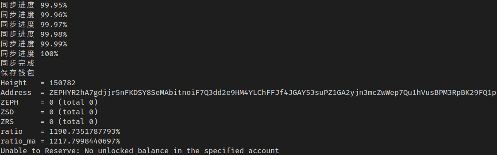
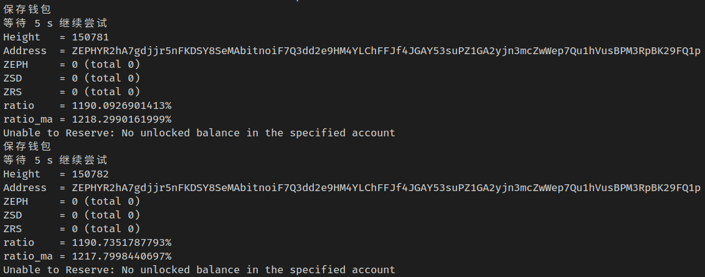

# ZEPH 自动质押脚本

## 效果展示





## 直接运行

首先，强烈建议自己看一遍源码，明确源码不会转走你的钱，最多只会让你质押失败。

然后，强烈建议你用 zephyr 官方钱包生成一个新的地址，把要质押的钱转到新的地址上，把新地址的助记词来自动质押。

这是一个命令行软件，在 dist 目录里，作者提供了可以直接运行的二进制版本，如果你是 windows，编辑 .bat 文件配置好参数，如果你是 linux 或 macos 编辑 .sh 文件。

## 下载运行

第一步：拉取官方 zephyr-javascript 库，在文件夹下运行下面的命令

```bash
git submodule update --init
```

第二步：用下面的命令让 npm 安装依赖

```bash
npm install
```

第三步：启动

```bash
node --no-experimental-fetch index.js --wallet=MyWallet --server=http://146.56.136.155:17767 --mnemonic="huge huge huge huge huge huge huge huge huge huge huge huge huge huge huge huge huge huge huge huge huge huge huge huge huge" --restore=140000 --tick=1000
```

参数解释：

* `wallet=MyWallet`： zephyr 会将 wallet 储存到硬盘上，这里设置储存的名字
* `server=http://146.56.136.155:17767`：设置节点，可参考社区节点
* `mnemonic="blabla"`：帮记词
* `restore=140000`：恢复高度
* `tick=1000`：每隔 1000ms 检查一次是否可以质押

## 支持作者

作者的 ZEPH 地址

```
ZEPHsAskRc6L8J8cvaSqPVHpBxxX1cTCmca71peeZhuhQjN8vKbD3bqZcuQdZ81iK7hbvNksa5H6QHkZaPkKWs2sLA7g5aXuCLG
```
